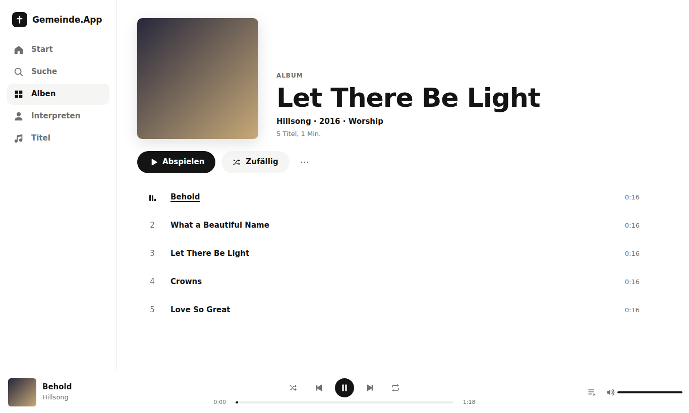
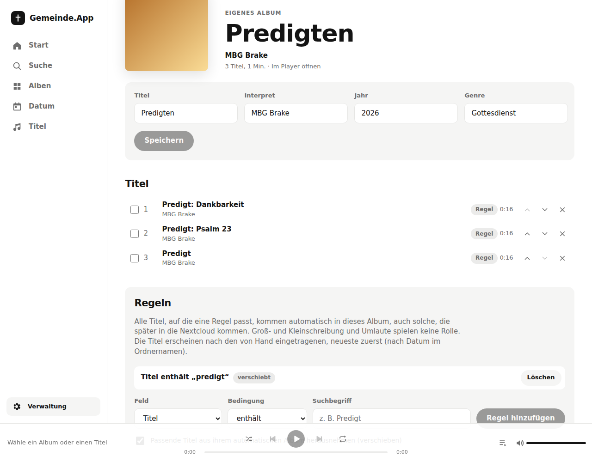
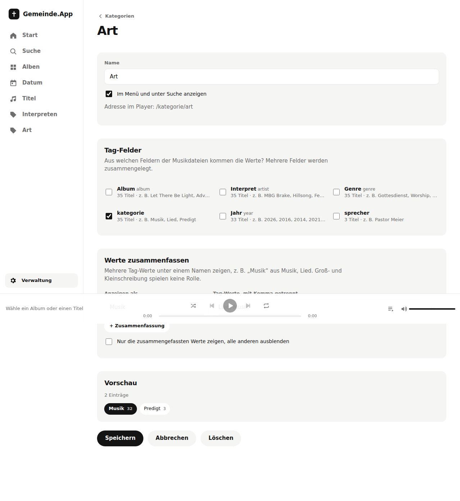
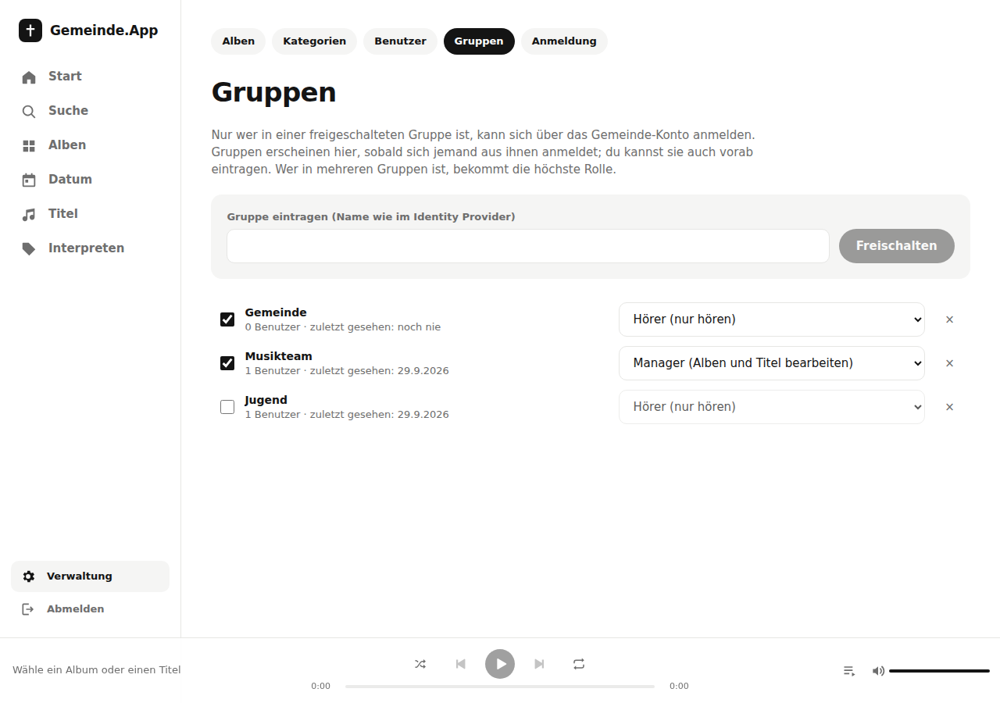

# Gemeinde.App

Minimalistischer Musikplayer für die Gemeinde, der seine Musik direkt aus einer Nextcloud liest.
Alben und Suchfilter entstehen automatisch aus Tags und Ordnerstruktur.

Dieser Stand enthält die **Musikbibliothek** (Backend), die **Weboberfläche** zum Hören, eine
**Verwaltung** für Alben und die **Anmeldung** über einen lokalen Admin oder OIDC mit den Rollen
Admin, Manager und Hörer.



## Weboberfläche

Bedienung wie bei Spotify oder Apple Music, Farben schlicht schwarz auf weiß wie auf
mbg-bielefeld-brake.de (mit Dunkelmodus, der der Systemeinstellung folgt).

- **Start**: Begrüßung mit Vornamen, der neueste Gottesdienst groß oben, „Weiterhören“ (angefangene
  Predigten mit Fortschritt), „Zuletzt gehört“, weitere Gottesdienste, „Neue Musik“ (ohne Gottesdienste), eigene
  Favoriten, Genres als Kacheln und Jahrzehnte
- **Gottesdienste**: Alben mit Datum heißen nach dem Anlass mit Wochentag und Datum
  („Erntedank, So., 27.09.2026“) und bekommen ohne eigenes Bild ein Kalenderblatt als Cover.
  Sprecher und Bibelstelle kommen aus den Tags `Sprecher`/`Speaker`/`Prediger`/`Referent` bzw.
  `Bibelstelle`/`Bibeltext`/`Predigttext`/`Scripture` oder werden in der Verwaltung am Album gesetzt,
  dort auch eine Beschreibung für Hörer. Fehlen die Tags, liest die App den Sprecher aus Dateinamen wie
  `2026-09-27 Meier - Psalm 23.mp3` und die Bibelstelle aus Titel oder Dateiname („Psalm 23“, „Joh 3,16“,
  „1. Kor 13,1-13“). Wer predigt, steht als Interpret am Gottesdienst („Mehr von Meier“), das Jahr kommt
  aus dem Datum. Die Kategorie „Sprecher“ ist vorgegeben (im Menü, sobald es Sprecher gibt)
- **Favoriten**: Herz an Titeln und Alben, eigene Seite „Favoriten“ je Hörer
- **Suche**: Treffer beim Tippen, gruppiert nach Interpreten, Titeln und Alben; findet auch eigene
  Tag-Felder wie den Sprecher, Predigten neueste zuerst; ohne Suchbegriff Vorschläge und Stöbern nach Genre. Treffer im
  Titel stehen vorn: bei Alben genauer Titel, dann Titelanfang, dann Interpret, dann Alben, in denen nur
  ein Titel passt; bei Titeln zuerst die, die mit dem Suchbegriff beginnen
- **Suchvorschläge**: Die leere Suchseite zeigt „Zuletzt gesucht“ (nur auf diesem Gerät, beim Abmelden
  gelöscht), „Häufig gesucht“ und „Oft gehört“ (Alben mit Wiedergaben laut verdecktem Scoring). Ein
  Suchbegriff zählt erst, wenn aus seinen Treffern etwas geöffnet wird, und nur, wenn er in der Bibliothek
  etwas findet; angezeigt wird er erst, wenn ihn mindestens 3 verschiedene Personen verwendet haben. Wer was
  gesucht hat, zeigt weder Oberfläche noch API; Einträge verschwinden nach 90 Tagen und mit dem Benutzer.
- **Interpreten**: Schreibweisen werden zusammengefasst („Hillsong United“ = „Hillsong UNITED“), Gäste
  aus „feat.“/„ft.“ stehen als eigene Interpreten in der Liste und finden den Titel
- **Verdecktes Scoring**: Titel, die oft gehört werden, stehen in der Suche und im Genre-Vorschlag auf
  der Startseite weiter oben. Gezählt wird eine Wiedergabe nach 30 Sekunden tatsächlich gehörter Zeit
  (kurze Titel nach der Hälfte), je Person und Titel höchstens einmal in 6 Stunden, über alle Hörer
  zusammen. Ältere Wiedergaben verlieren mit einer Halbwertszeit von 90 Tagen an Gewicht. Innerhalb
  ähnlicher Beliebtheit bleibt die gewohnte Reihenfolge (neueste Gottesdienste zuerst). Zahlen werden
  nirgends angezeigt; „Letzter Gottesdienst“, „Neu hinzugefügt“ und bewusst gewählte Sortierungen
  (Titel, Jahr, Neu hinzugefügt) bleiben unberührt
- **Alben, Titel**: Sortierung und Filter-Chips für Genre und Jahrzehnt, lädt beim Scrollen nach. Alben
  zeigt zuerst nur Musik; Umschalter „Musik / je Art (Gottesdienste, Bibelstunden …) / Alle“ (über Suche, Genre oder Jahrzehnt
  kommend: Alle). Sortiert wird wie im Telefonbuch: Umlaute bei ihrem Grundbuchstaben („Ärger“ bei A),
  Zahlen nach Wert („2 Lieder“ vor „10 Gebote“), ein englisches „The“ am Anfang zählt nicht; Sortier-Tags
  der Dateien (`ALBUMSORT`, `TSOA` …) haben Vorrang. „Neu hinzugefügt“ richtet sich danach, wann die
  Dateien in die Nextcloud kamen (Upload-Zeit, sonst Änderungsdatum)
- **Datum**: Jedes Album mit Datum erscheint hier mit Wochentag und Datum, neueste zuerst und nach
  Monaten gruppiert, dieselben Einträge wie unter Alben → Gottesdienste. Erkannt werden z. B.
  `2026-09-27 Gottesdienst`, `20260927`, `27.09.2026`, `27.9.26` und `27. September 2026`; fehlt das Jahr
  (`30.11.`, `3. Mai`), gilt das eines übergeordneten Ordners (`Predigten/2025/30.11.`). Das Datum kommt
  aus dem Albumordner, aus einem übergeordneten Ordner (`2026-09-27/Predigt` und `2026-09-27/Lobpreis`
  sind ein Gottesdienst) oder aus den Dateinamen: Tragen in einem Ordner ohne Datum die meisten Dateien
  eines im Namen (`Predigten 2026/2026-09-27 Meier - Psalm 23.mp3`), wird jedes Datum ein eigener
  Gottesdienst. Disc-Unterordner (`CD 1`, `CD 2`) zählen zum Elternordner. Interpreten sind weiter über
  Suche und Links erreichbar. Gibt es mehrere Arten von Aufnahmen (Gottesdienste, Bibelstunden), filtern
  Chips nach Art; die Startseite zeigt je Art eine Reihe, die Albenseite hat je Art ein eigenes Feld im
  Umschalter (Musik / Gottesdienste / Bibelstunden / Alle). Wie Aufnahmen erkannt und benannt werden, steht in
  der Verwaltung unter „Zuordnung“ (siehe unten).
- **Album- und Interpretenseite**: Abspielen, Zufällig, Titelliste (Doppel-CDs getrennt), „Mehr von …“
- **Player**: Leiste unten mit Zufall, Wiederholen (alle/einen), Spulen und Lautstärke; Warteschlange
  mit „Als Nächstes spielen“ und „Zur Warteschlange hinzufügen“. Auf dem Handy Mini-Player über der
  Tab-Leiste, der sich zu „Jetzt läuft“ aufklappt (nach unten wischen schließt, Link zum Album;
  auf iPhone/iPad ohne Lautstärkeregler, dafür gibt es die Tasten).
- **Predigt-Player**: Titel ab 10 Minuten bekommen 15 s zurück / 30 s vor statt Zufall und
  Wiederholen, ein Tempo von 1× bis 2× und merken sich je Hörer die Stelle zum Weiterhören
  (auch geräteübergreifend, auf dem Server gespeichert).
- **Mehr** (Handy-Tab bzw. Name unten in der Seitenleiste): Profil, Favoriten, Kategorien,
  Textgröße (Normal, Groß, Sehr groß), Installationshinweis, Verwaltung und Abmelden
- **Als App installieren**: Web-App-Manifest und Icons; Android/Chrome bieten die Installation an,
  für iPhone steht die Anleitung auf der Startseite und unter „Mehr“.
- Steuerung über Sperrbildschirm und Medientasten (Media Session), Leertaste spielt/pausiert, `/`
  öffnet die Suche. Warteschlange und Position überstehen ein Neuladen.

Die Farben stehen als CSS-Variablen oben in `web/src/styles.css` und lassen sich dort zentral anpassen.
Die Oberfläche ist mit Vite und Preact gebaut (ca. 17 KB JavaScript, gzip) und wird vom selben Server
unter `/` ausgeliefert; es ist kein zweiter Container nötig.

## Offline hören

Die App ist eine installierbare Web-App (PWA). Ein Service Worker (`web/sw/sw.js`) hält die Oberfläche
offline bereit. Mit dem Pfeil nach unten bei einem Album oder Gottesdienst (oder „Herunterladen“ im
Titelmenü) speichert die App Titel samt Cover auf dem Gerät; „Mehr > Heruntergeladen“ zeigt sie mit
Speicherbedarf. Ohne Verbindung zum Server startet die App direkt in dieser Ansicht.

Schutz gegen das Weitergeben der Dateien (ganz verhindern lässt sich ein Mitschnitt im Browser nicht):

- Es gibt keinen Datei-Download. Die Titel liegen in IndexedDB, in Stücken mit AES-256-GCM verschlüsselt.
- Den Schlüssel gibt es je Benutzer vom Server (`GET /api/me/offline`). Die App legt ihn als nicht
  exportierbaren Schlüssel ab; entschlüsselt wird nur im Speicher zum Abspielen.
- Ohne Kontakt zum Server verfallen die Kopien nach 30 Tagen (einstellbar). Beim Abmelden, wenn der
  Server die Sitzung nicht mehr kennt (Sperrung, Rolle entzogen) oder wenn Offline abgeschaltet wird,
  löscht die App alles. Sperren und Abschalten verwerfen zusätzlich den Schlüssel auf dem Server.
- Admins schalten Offline unter Verwaltung > Anmeldung > „Offline hören“ an oder aus und legen die Frist fest.

iPhones geben Web-Apps nur begrenzt Speicher und räumen ihn nach längerer Nichtnutzung auf.

## Verwaltung: Alben zusammenstellen und korrigieren

Unter `/admin` (Link „Verwaltung“ in der Seitenleiste bzw. unter „Mehr“) lassen sich Alben
von Hand pflegen. Die Verwaltung sehen nur Manager und Admins.

- **Eigene Alben**, z. B. „Predigten 2024“: Titel über die Suche hinzufügen, per Pfeil umsortieren,
  entfernen. Ein Titel kann in beliebig vielen Alben stehen. Interpret, Jahr, Genre und Cover
  ergeben sich aus den Titeln, lassen sich aber überschreiben.
- **Automatische Alben korrigieren**: Titel, Interpret, Jahr und Genre ändern (und wieder auf
  „automatisch“ zurücksetzen), einzelne Titel herausnehmen und zurückholen oder das ganze Album
  für Hörer ausblenden.
- **Regeln** füllen eigene Alben automatisch, z. B. „Titel enthält Predigt“ oder „Ordner/Dateiname
  enthält Gottesdienste/2024“. Möglich sind Titel, Interpret, Album, Genre und Ordner/Dateiname mit
  „enthält“, „enthält nicht“, „beginnt mit“ oder „ist genau“; Groß-/Kleinschreibung und Umlaute
  spielen keine Rolle. Bedingungen lassen sich in Gruppen mit UND/ODER verschachteln (bis zu 4 Ebenen),
  z. B. „Titel enthält Predigt UND (Interpret ist Meier ODER Interpret ist Schulz)“. Mehrere Regeln
  eines Albums gelten mit ODER; bestehende Regeln lassen sich bearbeiten. Neue passende Titel kommen beim nächsten Scan von
  selbst dazu, neueste zuerst (nach Datum im Ordnernamen). Vor dem Speichern zeigt eine Vorschau, wie
  viele Titel die Regel trifft. Einen Titel, den man aus so einem Album entfernt, fügt die Regel nicht
  wieder hinzu.
- **Verschieben statt kopieren**: Titel in einem automatischen Album auswählen und „Zu eigenem Album
  hinzufügen“. Mit „herausnehmen“ verschwinden sie aus dem bisherigen Album, sonst stehen sie in beiden.
  Dasselbe gibt es für Regeln („verschieben“).



Alle Eingriffe werden getrennt von den gescannten Daten gespeichert (nach Dateipfad bzw. Album) und
bei jedem Scan wieder angewendet. Fehlt eine Datei eines eigenen Albums zeitweise in der Nextcloud,
erscheint sie nach dem nächsten Scan wieder an ihrem Platz. Wird eine Datei in der Nextcloud umbenannt
oder verschoben, erkennt der Scan sie an ihrer Datei-ID wieder: Sie behält ihren Platz in eigenen Alben,
Favoriten, Weiterhören-Stellen und Beliebtheit. Ändert sich ein Album-Tag oder Ordnername, lebt das
Album mit derselben ID weiter, wenn die meisten Titel dorthin gewandert sind; Favoriten, Korrekturen
und herausgenommene Titel bleiben erhalten.

**Prüfen** (Verwaltung → Prüfen) zeigt, wo die automatische Zuordnung vermutlich nicht passt: Ordner,
die wegen unterschiedlicher Album-Tags in mehrere Alben zerfallen, Gottesdienste ohne Sprecher,
Interpreten, die wie ein Datum oder Jahr aussehen oder fehlen, Interpreten in mehreren Schreibweisen
und Musikalben ohne Bild.

## Verwaltung: Zuordnung von Aufnahmen

Unter **Verwaltung → Zuordnung** (Manager und Admins) steht das Regelwerk, nach dem die App Gottesdienste,
Bibelstunden und eigene Arten von Aufnahmen erkennt, benennt und abspielt. Vorgegeben gilt es für Ordner mit Datum;
Musik bleibt unberührt.
Vorgegeben ist diese Ablage:

```
Audio Aufnahmen/2026/2026_08_30_Einschulung/Predigt - Der gute Hirte.mp3
Audio Aufnahmen/2026/Bibelstunden/2026_01_14_Matthäus 9, 27-38/2026_01_14_001.mp3
```

Das Regelwerk arbeitet in drei Schritten: **1. Art bestimmen**, **2. Ordner- und Dateinamen nach den Mustern der Art
lesen**, **3. Policies** für Predigt und Player.

| Art | Bestimmt durch | Ordnername | Dateiname | Name des Albums | Titel |
| --- | --- | --- | --- | --- | --- |
| Bibelstunde | Regel „Ordner im Pfad ist genau Bibelstunden“ | `{datum}_{bibelstelle}` | `{datum}_{nr}` | `{bibelstelle}` | `Teil {nr}` |
| Gottesdienst | Vorgabe für übrige Ordner mit Datum | `{datum}_{anlass}` | `{inhalt} - {titel} - {sprecher}` | `{anlass}` | `{inhalt}: {titel}` |

Daraus werden „Einschulung“ mit „Predigt: Der gute Hirte“ und die Bibelstunde „Matthäus 9, 27-38“ mit
„Teil 1“. Aus `Predigt - Der gute Hirte - Pastor Meier.mp3` wird Pastor Meier Sprecher und Interpret des
Gottesdienstes; bei `Lied - Nun danket alle Gott - Chor.mp3` ist der Chor Interpret des Liedes, aber nicht
Sprecher. Fehlt der Name am Ende, bleibt es beim Titel.

- **Art bestimmen**: eine geordnete Liste „Wenn … dann Art …“ je Albumordner. Bedingungen auf Ordner im Pfad, Pfad und
  die Tags der Dateien (Genre, Album, Interpret, Titel), verschachtelbar mit UND/ODER; eine Regel passt, wenn der
  Ordner oder eine Datei darin passt. Die erste passende Regel gilt, auch „Keine Art (Musik)“ ist möglich. Regeln
  gelten standardmäßig nur für Ordner mit Datum, auf Wunsch auch für andere. Passt keine Regel, bekommen Ordner mit
  Datum die Vorgabe („Sonst, bei Ordnern mit Datum“, vorgegeben Gottesdienst, auch „keine“ möglich).
- **Arten**: Gottesdienst und Bibelstunde sind nur Vorgaben; Arten lassen sich umbenennen, löschen und neu anlegen
  (etwa „Jugendabend“), bis zu zehn. Beim Umbenennen ziehen Regeln, Vorgabe und Policies mit.
- **Art je Album**: Der Album-Editor zeigt, woher die Art kommt (Regel, Vorgabe oder von Hand), und lässt sie von Hand
  setzen, auch „Keine Art (Musik)“. Das geht dem Regelwerk vor, wie alle Korrekturen aus der Verwaltung.
- **Muster** für Ordner- und Dateinamen mit den Platzhaltern `{datum}`, `{anlass}`, `{bibelstelle}`,
  `{sprecher}`, `{inhalt}`, `{titel}` und `{nr}`. Trennzeichen sind austauschbar („ - “, „_“, „.“, „:“); zwischen
  zwei freien Textfeldern (etwa `{sprecher} - {titel}`) muss aber ein echtes Trennzeichen stehen, kein
  Leerzeichen. Alles nach dem ersten Platzhalter ist optional (`{datum}_{anlass}` passt auch auf `2026_09_06`),
  eine vorangestellte Tracknummer (`03 Lied - …`) wird erkannt.
- **Vorlagen** für den Namen des Albums und den Titel einer Aufnahme; leere Platzhalter fallen samt Trennern weg.
- **Policies** („Wenn … dann …“) legen fest, was als Predigt gilt und welcher Player läuft. Bedingungen auf Art,
  Inhalt, Titel, Interpret, Album, Genre, Ordner, Pfad und Dauer (Minuten) lassen sich mit UND/ODER verschachteln.
  Wirkungen: **gilt als Predigt** (liefert Sprecher `{sprecher}` und Bibelstelle `{bibelstelle}`, sonst aus ihrem
  Titel erkannt; wer predigt, steht als Interpret am Gottesdienst) und **Player** (Predigt-Player mit Sprüngen, Tempo
  und Weiterhören oder Musik-Player). Die Liste gilt von oben nach unten, je Wirkung entscheidet die erste passende
  Policy. Ohne passende Policy ist ein Titel keine Predigt und bekommt ab 10 Minuten Länge den Predigt-Player.
  Vorgegeben: „Art ist genau Gottesdienst und Inhalt ist genau Predigt“ und „Art ist genau Bibelstunde“, beide
  Predigt mit Predigt-Player. Regelwerke von vor den Policies werden beim Laden umgerechnet.
- **Policy je Titel ansehen und korrigieren**: Im Album-Editor zeigt jeder Titel seinen Player samt Quelle
  (Policy, von Hand oder nach Länge). Beim Bearbeiten eines Titels lassen sich „gilt als Predigt“ und Player von Hand
  setzen; „Automatisch“ zeigt, was die Policies ergeben. Korrekturen überstehen neue Scans und gehen den Policies vor.
- **Trennzeichen aus der Datei**: Enthält ein Dateiname „ - “, wird nur dort getrennt; `Text_Richter 7,1-4` oder
  `Matthäus 7,7-14` bleiben ein Teil. „Text_“ vor einer Bibelstelle wird lesbar („Einleitung: Richter 7,1-4“,
  „Predigt: Bergpredigt (Matthäus 7,7-14)“), übrige Unterstriche werden Leerzeichen.
- **Inhalte ohne Titel** (Begrüßung, Gebet, Abkündigungen, Segen …): Folgt nur ein Teil, ist das der Name.
  `Begrüßung - Jakob Rauschenberger` wird „Begrüßung“ mit Jakob Rauschenberger; bei `Lied - Großer Gott` bleibt
  „Großer Gott“ der Titel.
- **Inhalte**: Liste, was am Anfang eines Dateinamens stehen kann; nötig für Inhalte aus mehreren Wörtern.
  Der Inhalt jeder Aufnahme steht in der Kategorie „Inhalt“ (vorgegeben, zunächst nicht im Menü) und in der Suche.
- **Tags**: Standardmäßig gilt der Dateiname, auch wenn die Datei Tags hat. Je Art lässt sich einstellen, dass
  vorhandene Tags (Titel, Album, Interpret) Vorrang haben. Ohne Namen im Dateinamen und ohne Interpret-Tag steht
  bei einer Aufnahme der Sprecher, sonst die Art („Gottesdienst“); die Art erscheint nicht in der Interpretenliste.
- **Vorschau** zeigt vor dem Speichern je Art die Anzahl, die neuesten Beispiele und Dateien, die nicht zum
  Muster passen. **Speichern und anwenden** bildet die Alben sofort neu, ohne neuen Scan.

## Verwaltung: Schreibweisen

Unter **Verwaltung → Schreibweisen** (Manager und Admins) lassen sich Tippfehler, die in vielen Titeln stehen, einmal
für alle korrigieren, etwa „Tema“ → „Thema“. Die Ersetzungen gelten für Titel und Albumnamen in der App, in der Suche
und in der Sortierung; die Dateien in der Nextcloud bleiben unverändert. Von Hand korrigierte Titel und Alben
behalten ihren Namen.

- Groß- und Kleinschreibung spielt beim Suchen keine Rolle; ein großgeschriebener Fund bleibt groß („TEMA“ → „THEMA“).
- Standardmäßig nur ganze Wörter („Tematik“ bleibt); wahlweise auch innerhalb von Wörtern. Leerer Ersatz entfernt das Wort.
- Die Vorschau zeigt vor dem Speichern, welche Titel und Alben sich ändern. Die Suche findet weiterhin auch die
  alte Schreibweise aus der Datei.

## Verwaltung: Kategorien

Unter **Verwaltung → Kategorien** legt man eigene Kategorien an, benennt sie um, ordnet sie oder löscht sie.
Jede Kategorie mit „Im Menü anzeigen“ steht in der Seitenleiste und unter Suche, mit einer Seite aller Werte
(`/kategorie/<name>`) und je Wert einer Seite mit Alben und Titeln zum Abspielen.

- **Tag-Felder**: Eine Kategorie nimmt ihre Werte aus einem oder mehreren Feldern der Musikdateien, z. B.
  „Interpreten“ aus Interpret und Album-Interpret. Zur Auswahl stehen alle Felder, die in der Bibliothek vorkommen,
  auch eigene ID3-Felder (TXXX, etwa „Kategorie“ oder „Sprecher“) und eigene Vorbis-Kommentare in FLAC/Ogg.
  Mehrere Werte in einem Feld („Chor; Gemeinde“) werden einzeln geführt. Zusätzlich gibt es das Feld „Dateiname“
  (ohne Endung). „Inhalt anzeigen“ listet alle aktuell gescannten Werte eines Felds mit Anzahl Titel und Filter;
  ein Klick auf einen Wert übernimmt ihn in die letzte Zusammenfassung.
- **Werte zusammenfassen**: Mehrere Tag-Werte erscheinen unter einem Namen, z. B. „Musik“ aus Musik, Lied.
  Groß-/Kleinschreibung und Akzente spielen dabei keine Rolle. Wahlweise zeigt die Kategorie nur die
  zusammengefassten Werte.
- **Vorschau**: Beim Einrichten zeigt die Verwaltung sofort, welche Werte mit wie vielen Titeln entstehen.

Vorgegeben sind „Interpreten“ (im Menü), „Genre“ (nicht im Menü), „Sprecher“ aus den Predigt-Feldern
(im Menü, wenn es beim Update schon Sprecher gab) und „Inhalt“ aus der Zuordnung von Aufnahmen (nicht im Menü). Die Filter nach Genre und Jahrzehnt
sowie der Reiter „Datum“ bleiben davon unberührt. Beim ersten Start mit dieser Version liest der Scan alle
Dateien einmal neu, um auch die übrigen Tag-Felder zu erfassen.



## Anmeldung, Benutzer und Rollen

Die ganze App (auch der Player) ist nur nach Anmeldung erreichbar. Die Anmeldeseite zeigt den Namen
der Gemeinde und einen Begrüßungstext (Verwaltung → Anmeldung). Ist OIDC eingerichtet, sehen Hörer
nur „Mit Gemeinde-Konto anmelden“; die Anmeldung des lokalen Admins steht unter `/?admin`.

- **Lokaler Admin** `admin`: Das Passwort kommt aus `ADMIN_PASSWORD`. Ein neuer oder geänderter
  Wert gilt nach dem nächsten Neustart (`docker compose up -d`), auch wenn die Datenbank schon
  existiert. Solange der Wert gleich bleibt, gilt ein unter Verwaltung → Anmeldung geändertes
  Passwort weiter. Ohne `ADMIN_PASSWORD` wird beim ersten Start eines erzeugt und in
  `/data/admin-password.txt` geschrieben, nicht ins Log
  (`docker compose exec gemeinde-app cat /data/admin-password.txt`; nach dem Ändern in der Verwaltung
  die Datei löschen); `RESET_ADMIN_PASSWORD=true` erzeugt ein neues.
  Enthält das Passwort ein `$`, muss es in der `.env` als `$$` geschrieben werden, weil Docker
  Compose `$` als Variable liest.
- **Alle anderen** melden sich über OIDC mit ihrem Gemeinde-Konto an (Keycloak, Authentik, Nextcloud,
  Entra ID u. a.). Eingerichtet wird das unter Verwaltung → Anmeldung: Issuer-URL, Client-ID,
  Client-Secret und der Claim mit den Gruppen (Standard `groups`, verschachtelt z. B.
  `realm_access.roles`). Die Weiterleitungs-URL für den Client im Identity Provider steht dort zum
  Kopieren. Anmeldung mit Authorization Code und PKCE; Gruppen, die nicht im ID-Token stehen,
  werden über den Userinfo-Endpunkt gelesen.
- **Gruppen** (Verwaltung → Gruppen): Jede Gruppe, die beim Login mitkommt, erscheint dort; man
  kann Gruppen auch vorab eintragen. Nur Gruppen mit Haken sind freigeschaltet, und nur wer in einer
  freigeschalteten Gruppe ist, wird als Benutzer angelegt. Jede Gruppe bekommt eine Rolle; wer in
  mehreren ist, erhält die höchste. Änderungen gelten sofort, auch für bereits angemeldete Benutzer.
- **Abgewiesene Anmeldung**: Kommt jemand nicht hinein („Dein Konto ist … nicht freigeschaltet“),
  zeigt Verwaltung → Gruppen die letzte abgewiesene Anmeldung mit den gelieferten Gruppen, die sich
  dort direkt freischalten lassen. Liefert der Identity Provider gar keine Gruppen, stehen dort die
  erhaltenen Claims; bei Authentik kommen die Gruppen über den Scope `profile` im Claim `groups`.
- **Benutzer** (Verwaltung → Benutzer): Liste mit Rolle, Gruppen und letzter Anmeldung. Einzelne
  Benutzer lassen sich sperren oder entfernen.

| Rolle | Darf |
| --- | --- |
| Admin | alles: Alben und Titel, Scan, Benutzer, Gruppen, OIDC-Schnittstelle |
| Manager | Alben, Titel und Regeln bearbeiten, Scan starten |
| Hörer | nur den Player nutzen; die Verwaltung ist ausgeblendet |

Sitzungen laufen über ein HttpOnly-Cookie (SameSite=Lax, bei https mit Secure) und bleiben 30 Tage
nach der letzten Nutzung gültig. Anmeldungen über OIDC enden zusätzlich spätestens 30 Tage nach der
Anmeldung; danach geht es einmal über den Identity Provider, der dabei die aktuellen Gruppen liefert.
Wer dort aus einer Gruppe entfernt wird, verliert den Zugang also spätestens nach 30 Tagen (sofort:
Benutzer in der Verwaltung sperren). In der Datenbank steht nur ein Hash der Sitzungs-ID, das Passwort
des lokalen Admins als scrypt-Hash. Nach zehn Fehlversuchen ist die Passwort-Anmeldung je IP für
15 Minuten gesperrt, nach hundert Fehlversuchen von beliebig vielen IPs auch je Benutzername; es laufen
höchstens zwei Passwortprüfungen gleichzeitig. Jede Antwort trägt Sicherheits-Header (Content-Security-Policy,
kein Einbetten in fremde Seiten, `nosniff`, bei https HSTS).



## So funktioniert es

- Ein **Service-Account** in der Nextcloud (mit App-Passwort) liest genau die Ordner, die in
  `NEXTCLOUD_MUSIC_PATH` stehen, samt Unterordnern; alles andere im Account bleibt unberührt.
  Mehrere Ordner trennst du durch Komma, Semikolon oder Zeilenumbruch, z. B.
  `NEXTCLOUD_MUSIC_PATH=/Gemeinde/Musik, /Gemeinde/Predigten`. Kommt ein Ordner dazu oder fällt einer
  weg, rechnet die App beim Start die gespeicherten Pfade um; eigene Alben, Korrekturen und Regeln
  bleiben erhalten. Stell dabei den bisherigen Ordner an die erste Stelle.
  Ordnernamen mit Komma oder Semikolon lassen sich deshalb nicht angeben.
  Ein mit dem Service-Account geteilter Ordner erscheint in dessen Dateien und kann direkt
  angegeben werden. Nutzer brauchen keinen Nextcloud-Zugang. Den genauen Pfad zeigt die
  Nextcloud-Weboberfläche des Service-Accounts in der Brotkrumen-Navigation.
- Der **Scan** läuft beim Start und danach im eingestellten Intervall. Er ist inkrementell:
  Nur neue Dateien und solche mit geändertem ETag werden gelesen, und davon nur der Anfang mit den
  Tags (256 KB, bei großen eingebetteten Covern etwas mehr). Nach dem Update auf diese Version
  liest der erste Scan alle Dateien einmal neu, um die Cover zu übernehmen. Gelöschte Dateien verschwinden aus der Bibliothek; Ordner, die gerade nicht lesbar
  sind, bleiben unangetastet. Ist ein ganzer Musikordner plötzlich leer oder fehlen auf einmal mehr als
  20 Titel und mehr als ein Fünftel der Bibliothek (etwa weil ein Speicher nicht eingehängt ist), entfernt
  der Scan nichts und wartet auf eine Bestätigung in der Verwaltung; sonst gingen Favoriten und
  Weiterhören-Stellen aller Hörer verloren. Stand, Fortschritt und letzten Fehler zeigt die Verwaltung unter
  **Alben** („Abgleich mit der Nextcloud“), dort startet „Jetzt scannen“ einen Scan sofort.
  Antwortet die Nextcloud auf eine Anfrage 60 Sekunden lang nicht, wird sie abgebrochen, damit ein
  einzelner hängender Download den Scan nicht aufhält.
- **Metadaten** kommen aus den Tags (MP3, FLAC, Ogg, Opus, …). Fehlt etwas, wird es aus dem Pfad
  abgeleitet, z. B. `Interpret/Album (2021)/CD 2/03 - Titel.mp3`. Ordner, die nur ein Jahr oder ein Datum
  sind, und der Ordner über einem Gottesdienst („Gottesdienste“) werden dabei nicht zum Interpreten.
  Nach dem Update auf die Version mit Sortier-Tags und Datei-IDs liest der erste Scan alle Dateien einmal neu.
- **Alben** werden pro Albumordner und Albumname gebildet. Disc-Ordner (`CD 1`, `Disc 2`) werden
  zusammengefasst, Sampler mit vielen Interpreten bleiben ein Album („Verschiedene Interpreten“),
  Sammelordner mit Titeln aus mehreren Alben werden aufgeteilt. Titel ohne eigenen Album-Tag, Zusätze
  wie „(Remastered)“ oder „[Deluxe]“ und einzelne Abweichler in einem Ordner, in dem ein Album klar
  überwiegt (mindestens drei Titel und mehr als die Hälfte), zählen zu diesem Album. Als Albumcover dient `cover.jpg`,
  `folder.jpg`, `front.jpg` o. ä. im Albumordner, sonst das in die Dateien eingebettete Bild.
- **Titelbilder**: In MP3 (ID3) und FLAC eingebettete Cover werden beim Scan gelesen und in der
  Datenbank abgelegt (gleiche Bilder nur einmal). Jeder Titel zeigt sein eigenes Bild, ohne eigenes
  Bild das Albumcover. Große Tag-Blöcke werden dafür bis 8 MB nachgeladen. Nur JPEG, PNG, WebP und
  GIF zählen als Cover (ein SVG könnte Skripte enthalten).
- **Vorschaubilder**: Ordnerbilder und eingebettete Cover rechnet der Server beim ersten Abruf auf
  höchstens 640 px als WebP herunter und legt sie in der Datenbank ab; danach fragt eine
  Albenübersicht die Nextcloud nicht mehr. Ändert sich ein Bild, entsteht nach dem nächsten Scan eine
  neue Vorschau. Lässt sich ein Bild nicht verkleinern, wird das Original gezeigt.
- **Suche und Filter**: Volltextsuche mit Präfix und ohne Rücksicht auf Umlaute/Akzente (SQLite FTS5),
  Filter nach Interpret, Genre, Jahr und Jahrzehnt.
- **Streaming** läuft über den Server mit Range-Unterstützung (Spulen im Browser), die
  Nextcloud-Zugangsdaten verlassen den Server nie.

Die Daten liegen in einer SQLite-Datenbank im WAL-Modus, ausgelegt auf viele gleichzeitige Leser
(Zielgröße: ca. 200 Nutzer auf einem Server).

## Betrieb mit Docker

```bash
cp .env.example .env    # Werte eintragen
docker compose up -d --build
curl localhost:3000/api/health
```

**Docker in einer Proxmox-LXC:** Bricht der Build mit `failed to solve: exit code: 1` ab (oft schon
bei `Dockerfile:1`) oder startet der Container nicht, verweigert meist AppArmor Docker die eigenen
Profile. In `/etc/pve/lxc/<ID>.conf` auf dem Proxmox-Host helfen dann:

```
features: keyctl=1,nesting=1
lxc.apparmor.profile: unconfined
lxc.mount.entry: /dev/null sys/module/apparmor/parameters/enabled none bind 0 0
```

Danach die LXC neu starten (`pct reboot <ID>`). Die ganze Fehlermeldung zeigt
`docker compose build --progress=plain`.

Die Datenbank liegt im Volume `gemeinde-data` (`/data` im Container). Die Bibliothek selbst baut
jeder Scan aus der Nextcloud neu auf, eigene Alben und Korrekturen aus der Verwaltung gibt es aber
nur in dieser Datenbank: Das Volume gehört deshalb ins Backup.

**Sicherung:** Die App sichert die Datenbank einmal am Tag nach `/data/backups/library-JJJJ-MM-TT.db`
(konsistent per SQLite-Online-Backup, auch während sie läuft) und behält die letzten 14 Tage
(`BACKUP_KEEP`). Diese Dateien gehören zusätzlich außerhalb des Servers gesichert, z. B. per
`docker compose cp gemeinde-app:/data/backups ./backups` in einem nächtlichen Cronjob. Wiederherstellen:

```bash
docker compose stop gemeinde-app
docker compose run --rm --no-deps --entrypoint sh gemeinde-app -c \
  'cp /data/backups/library-2026-09-28.db /data/library.db && rm -f /data/library.db-wal /data/library.db-shm'
docker compose up -d
```

**Im Internet** gehört ein Reverse Proxy mit TLS (Traefik, Caddy, nginx) davor, und Port 3000 soll nur
für ihn erreichbar sein. `docker-compose.yml` bindet den Port deshalb standardmäßig nur an
`127.0.0.1` (Proxy auf demselben Server). Läuft der Proxy auf einem anderen Rechner, `APP_BIND` in der
`.env` auf die Adresse im internen Netz setzen; läuft er im selben Docker-Netz, braucht es gar keinen
veröffentlichten Port. `PUBLIC_URL` gehört dann immer gesetzt. `X-Forwarded-For`/`-Proto`/`-Host` glaubt
die App nur Absendern aus privaten Netzen (`TRUST_PROXY`), sonst könnte jeder seine IP fälschen und die
Sperre nach Fehlversuchen umgehen.

| Variable | Standard | Bedeutung |
| --- | --- | --- |
| `NEXTCLOUD_URL` | – | Basis-URL der Nextcloud |
| `NEXTCLOUD_USER` | – | Service-Account |
| `NEXTCLOUD_PASSWORD` | – | App-Passwort des Service-Accounts |
| `NEXTCLOUD_MUSIC_PATH` | – (Pflicht) | Ordner, die gescannt werden, relativ zu den Dateien des Service-Accounts, z. B. `/Gemeinde/Medien/Musik`. Mehrere durch Komma, Semikolon oder Zeilenumbruch getrennt. Nur diese Ordner und ihre Unterordner kommen in die Bibliothek. |
| `ADMIN_PASSWORD` | – | Passwort des lokalen Admins `admin`; gilt nach jedem Neustart, bei dem es sich geändert hat. Ohne Angabe wird beim ersten Start eines erzeugt und geloggt |
| `RESET_ADMIN_PASSWORD` | `false` | `true` setzt das Passwort des lokalen Admins bei jedem Start auf `ADMIN_PASSWORD` bzw. ein neu erzeugtes zurück |
| `PUBLIC_URL` | – | Öffentliche Adresse, z. B. `https://musik.gemeinde.de`; ergibt die OIDC-Weiterleitungs-URL und ist Pflicht, um OIDC einzuschalten |
| `TRUST_PROXY` | private Netze | Wem `X-Forwarded-*` geglaubt wird: `false`, `true` oder Adressen/Netze (z. B. `172.18.0.0/16`). Standard: Loopback und private Netze |
| `APP_BIND` | `127.0.0.1` | Nur `docker-compose.yml`: Adresse auf dem Host, an die Port 3000 gebunden wird; `0.0.0.0` für alle |
| `SCAN_INTERVAL_MINUTES` | `60` | Automatischer Scan, `0` = aus |
| `SCAN_CONCURRENCY` | `4` | Parallele Zugriffe auf die Nextcloud beim Scan |
| `DATABASE_PATH` | `/data/library.db` | Pfad der SQLite-Datei |
| `BACKUP_DIR` | `/data/backups` | Ordner der täglichen Sicherungen (Standard: `backups` neben der Datenbank) |
| `BACKUP_KEEP` | `14` | Wie viele tägliche Sicherungen bleiben, `0` = keine Sicherung |
| `WEB_DIR` | `/app/public` | Ordner der gebauten Weboberfläche; fehlt er, läuft nur die API |
| `PORT` / `HOST` | `3000` / `0.0.0.0` | Adresse des HTTP-Servers |
| `LOG_LEVEL` | `info` | Log-Level (JSON-Logs) |

## API

Alle Pfade außer `/api/health` und `/api/auth/*` brauchen eine Sitzung (Cookie `gemeinde_session`),
sonst antworten sie mit 401; fehlt die Rolle, mit 403.

| Methode und Pfad | Zweck |
| --- | --- |
| `GET /api/albums?q=&artist=&genre=&year=&decade=&dated=&sort=artist\|title\|year\|recent\|date\|popular&limit=&offset=` | Alben suchen und filtern; `dated=true` nur Gottesdienste (Datum im Ordnernamen), `dated=false` nur Musik; `recording=Bibelstunde` nur eine Art aus der Zuordnung |
| `GET /api/albums/:id` | Album mit Titelliste |
| `GET /api/albums/:id/cover` | Albumcover (Bild im Ordner, sonst eingebettet) |
| `GET /api/tracks/:id/cover` | Bild des Titels, sonst Albumcover |
| `GET /api/tracks?q=&artist=&genre=&year=&decade=&albumId=&limit=&offset=` | Titel suchen und filtern |
| `GET /api/categories` | Kategorien in der eingestellten Reihenfolge (`{ id, name, slug, inNav }`) |
| `GET /api/categories/:slug/values?q=` | Werte einer Kategorie mit Anzahl Titel |
| `GET /api/tracks/:id/stream` | Audio streamen (unterstützt `Range`) |
| `GET /api/artists?q=` | Interpreten mit Anzahl Alben und Titel |
| `GET /api/dates?limit=&offset=&recording=` | Alben mit Datum (Gottesdienste), neueste zuerst; wie `/api/albums?dated=true&sort=date`; `recording` filtert nach Art |
| `GET /api/dates/folder?path=` | Album zu einem Ordnerpfad (für ältere Links auf `/datum/ordner`) samt Titeln |
| `GET /api/facets` | Genres, Jahrzehnte und Gesamtzahlen für die Filterleiste |
| `GET /api/scan` | Status des letzten Scans |
| `POST /api/scan` | Scan starten (Manager, Admin) |
| `GET /api/health` | Healthcheck |

Alle Listen liefern `{ items, total, limit, offset }`. Alben haben `kind: "auto" | "manual"`.
`/api/albums` und `/api/tracks` filtern mit `category=<slug>&value=<Wert>` nach dem Wert einer Kategorie.

Verwaltung (Manager und Admins):

| Methode und Pfad | Zweck |
| --- | --- |
| `GET /api/admin/albums?q=&kind=auto\|manual&dated=&hidden=&noSpeaker=` | Alle Alben inkl. ausgeblendeter; `dated` Gottesdienste oder Musik, `hidden=true` nur ausgeblendete, `noSpeaker=true` Gottesdienste ohne Sprecher |
| `POST /api/admin/albums` | Eigenes Album anlegen: `{ title, artist?, year?, genre?, trackIds?, move? }` |
| `GET /api/admin/albums/:id` | Album mit Korrekturen, herausgenommenen und fehlenden Titeln |
| `PATCH /api/admin/albums/:id` | `{ title?, artist?, year?, genre?, hidden? }`; `null` setzt auf automatisch zurück |
| `DELETE /api/admin/albums/:id` | Eigenes Album löschen (die Titel bleiben) |
| `POST /api/admin/albums/:id/tracks` | Titel anhängen: `{ trackIds, move? }`; `move` nimmt sie aus ihrem automatischen Album |
| `PUT /api/admin/albums/:id/tracks` | Inhalt und Reihenfolge eines eigenen Albums setzen: `{ trackIds }` |
| `DELETE /api/admin/albums/:id/tracks/:trackId` | Titel entfernen (bei automatischen Alben: herausnehmen) |
| `POST /api/admin/albums/:id/tracks/:trackId/restore` | Herausgenommenen Titel zurückholen |
| `PATCH /api/admin/albums/:id/tracks/:trackId` | Titel korrigieren: `{ title?, speaker? }`; `null` setzt auf den Wert aus der Datei zurück, die Korrektur übersteht Scans und folgt der Datei beim Umbenennen |
| `PUT /api/admin/albums/:id/cover` | Eigenes Titelbild hochladen; Body ist das Bild (`image/jpeg`, `image/png`, `image/webp`, höchstens 15 MB), gespeichert verkleinert als JPEG ohne Metadaten |
| `DELETE /api/admin/albums/:id/cover` | Eigenes Titelbild entfernen |
| `POST /api/admin/albums/:id/rules` | Regel anlegen: `{ condition, move? }` (siehe unten) |
| `PUT /api/admin/albums/:id/rules/:ruleId` | Regel ändern, gleicher Aufbau |
| `DELETE /api/admin/albums/:id/rules/:ruleId` | Regel löschen |
| `POST /api/admin/rules/preview` | `{ condition }`: wie viele und welche Titel eine Regel treffen würde |
| `GET /api/admin/track-albums?ids=1,2` | In welchen Alben die Titel stehen |
| `GET /api/admin/categories` | Alle Kategorien mit Tag-Feldern und zusammengefassten Werten |
| `POST /api/admin/categories` | Kategorie anlegen: `{ name, fields, groups?, inNav?, groupedOnly? }` |
| `PATCH /api/admin/categories/:id` | Umbenennen oder Zuordnung ändern, gleiche Felder, alle optional |
| `DELETE /api/admin/categories/:id` | Kategorie löschen |
| `PUT /api/admin/categories/order` | Reihenfolge: `{ ids }` |
| `POST /api/admin/categories/preview` | `{ fields, groups?, groupedOnly? }`: welche Werte entstehen würden |
| `GET /api/admin/tag-fields` | Alle Tag-Felder der Bibliothek mit Anzahl Titel und Beispielwerten |
| `GET /api/admin/tag-fields/:tag/values?q=&limit=` | Aktueller Inhalt eines Tag-Felds, häufigste Werte zuerst |
| `GET /api/admin/quality` | Hinweise zur Datenqualität (aufgeteilte Ordner, fehlende Sprecher und Cover, auffällige Interpreten) |
| `GET /api/admin/structure` | Regelwerk für Aufnahmen, Vorgabe und Platzhalter |
| `PUT /api/admin/structure` | Regelwerk speichern `{ kinds, contents }` und Alben neu bilden |
| `POST /api/admin/structure/preview` | Was ein Regelwerk aus der Bibliothek machen würde, je Art mit Beispielen |
| `GET /api/admin/replacements` | Ersetzungen für Tippfehler (Schreibweisen) |
| `POST /api/admin/replacements` | Ersetzung anlegen `{ search, replacement, wholeWord }` und Alben neu bilden |
| `PUT /api/admin/replacements/:id` / `DELETE …` | Ersetzung ändern bzw. löschen |
| `POST /api/admin/replacements/preview` | Welche Titel und Alben sich ändern würden, `{ search, replacement, wholeWord, id? }` |

`PATCH /api/admin/albums/:id` nimmt außerdem `speaker`, `passage` und `description` (Predigt-Infos).

Persönliches des angemeldeten Hörers:

| Methode und Pfad | Zweck |
| --- | --- |
| `GET /api/me/favorites` | Favorisierte Titel und Alben, neueste zuerst |
| `PUT/DELETE /api/me/favorites/:kind/:id` | Favorit setzen oder entfernen (`kind`: `track` oder `album`) |
| `GET /api/me/progress` | Gespeicherte Stellen angefangener langer Titel |
| `PUT /api/me/progress/:id` | Hörstand melden: `{ position, duration? }` |
| `GET /api/me/home` | „Weiterhören“ und „Zuletzt gehört“ für die Startseite |
| `POST /api/me/plays/:id` | Wiedergabe fürs verdeckte Scoring zählen (meldet der Player nach 30 s Hören) |

Eine `condition` ist entweder eine Bedingung `{ field: title|artist|album|genre|path, op: contains|not_contains|starts|equals, value }`
oder eine Gruppe `{ match: "all" | "any", conditions: [...] }` (UND bzw. ODER, beliebig verschachtelt, bis zu 4 Ebenen
und 30 Bedingungen). Statt `condition` geht für eine einzelne Bedingung auch `{ field, op, value }` direkt.

`groups` einer Kategorie ist eine Liste `{ label, values }`, z. B. `{ "label": "Musik", "values": ["Musik", "Lied"] }`.

Anmeldung und Benutzer:

| Methode und Pfad | Zweck |
| --- | --- |
| `GET /api/auth/status` | Angemeldeter Benutzer (oder `null`), ob OIDC eingerichtet ist, Name und Begrüßung der Gemeinde |
| `POST /api/auth/login` | Lokaler Admin: `{ username, password }` |
| `POST /api/auth/logout` | Abmelden |
| `POST /api/auth/password` | Passwort des lokalen Admins ändern: `{ current, next }` |
| `GET /api/auth/oidc/start?returnTo=` | Weiter zum Identity Provider |
| `GET /api/auth/oidc/callback` | Rückkehr vom Identity Provider |
| `GET /api/admin/users` | Benutzer (nur Admin) |
| `PATCH /api/admin/users/:id` | `{ disabled }` sperren oder entsperren (nur Admin) |
| `DELETE /api/admin/users/:id` | OIDC-Benutzer entfernen (nur Admin) |
| `GET /api/admin/groups` | Gesehene und eingetragene Gruppen (nur Admin) |
| `PUT /api/admin/groups/:name` | `{ enabled?, role?: listener\|manager\|admin }`, legt die Gruppe bei Bedarf an (nur Admin) |
| `DELETE /api/admin/groups/:name` | Gruppe entfernen (nur Admin) |
| `GET/PUT /api/admin/oidc` | OIDC-Einstellungen; das Secret wird nie ausgeliefert (nur Admin) |
| `GET /api/admin/changes?limit=&offset=` | Änderungsprotokoll der Verwaltung, neueste zuerst; die letzten 5.000 bleiben (nur Admin) |
| `POST /api/admin/oidc/test` | Discovery des Identity Providers testen (nur Admin) |
| `GET/PUT /api/admin/branding` | `{ name, welcome }` für Anmeldeseite, Seitentitel und App-Manifest (nur Admin) |

## Entwicklung

```bash
cd server
npm install
npm test            # Vitest, inkl. simulierter Nextcloud und simuliertem Identity Provider
npm run typecheck
NEXTCLOUD_URL=… NEXTCLOUD_USER=… NEXTCLOUD_PASSWORD=… NEXTCLOUD_MUSIC_PATH=… npm run dev

cd web
npm install
npm test            # Warteschlange, Formatierung, Titelliste, Player, Favoriten, Verwaltung, Anmeldung
npm run dev         # Oberfläche mit Hot Reload, /api geht an localhost:3000
```

Ohne Nextcloud ausprobieren: `cd web && npm run build && cd ../server && npm run demo` startet den
Server mit einer simulierten Nextcloud und ein paar Beispielalben unter http://localhost:3000
(lokaler Admin unter http://localhost:3000/?admin mit `admin` / `demo`; „Mit Gemeinde-Konto anmelden“ meldet über einen simulierten Identity
Provider Anna mit der Rolle Manager an).

Die Tests erzeugen winzige MP3- und FLAC-Dateien im Speicher und starten einen WebDAV-Server,
der sich wie Nextcloud verhält. Echte Musikdateien sind dafür nicht nötig.
